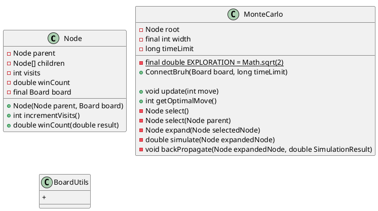

```plantuml
@startuml
!pragma layout smetana

class Node {
    -Node parent
    -Node[] children
    -int visits
    -double winCount
    -final Board board
    
    +Node(Node parent, Board board)
    +int incrementVisits()
    +double winCount(double result)

}

class MonteCarlo {
    -Node root
    -final int width
    -{static} final double EXPLORATION = Math.sqrt(2)
    -long timeLimit
    
    +ConnectBruh(Board board, long timeLimit)
    
    +void update(int move)
    +int getOptimalMove()
    -Node select()
    -Node select(Node parent)
    -Node expand(Node selectedNode)
    -double simulate(Node expandedNode)
    -void backPropagate(Node expandedNode, double SimulationResult)
}

class BoardUtils {
    +
}
@enduml
```